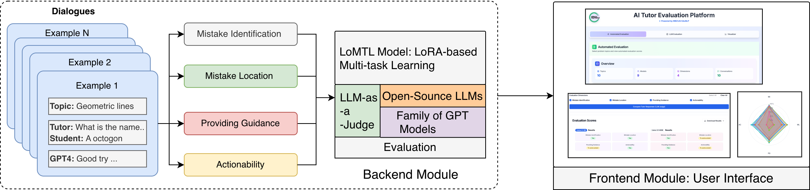

# AI Tutor Evaluation Toolkit



[](https://www.python.org/downloads/)
[](https://pytorch.org/)
[](LICENSE)

---

## Table of Contents

- [Overview](#overview)
- [Installation](#installation)
- [Quick Start](#-quick-start)
  - [Backend Module: AI Tutor Evaluation](#-backend-module-ai-tutor-evaluation-module)
    - [Evaluation with Automated Models](#evaluation-with-automated-model)
    - [Evaluation with Open-Source Models](#evaluation-with-open-source-model)
    - [Evaluation with GPT Models](#evaluation-with-gpt-5-model)
  - [Frontend Module: Demo App](#frontend-module-demo-app)
    - [Start the Local Server](#2-start-the-local-server)
- [Troubleshooting](#troubleshooting)
- [Documentation](#documentation)
- [Contributing](#contributing)
- [License](#license)
- [Contact](#contact)
- [Citation](#citation)
- [Acknowledgments](#acknowledgments)

---

## Overview
Welcome to **`AITutor-EvalKit`** ! 

**`AITutor-EvalKit`** provides a robust framework for assessing the **pedagogical effectiveness** of large language models (LLMs) as AI tutors in the **mathematics** domain.  

Developed by the **EduNLP Lab at MBZUAI**, this toolkit combines insights from **learning sciences** with recent advancements in **LLM technology** to systematically **evaluate**, **compare**, and **analyze** the pedagogical performance of AI tutoring models. Building on prior research – including the **NAACL 2025 SAC Award-winning paper** by *Maurya et al.* [1] and the **BEA 2025 Shared Task** by *Kochmar et al.* [2] – it introduces a **lightweight, modular framework** for **on-the-fly evaluation** of AI tutor responses, extending beyond static benchmarks to enable scalable and principled pedagogical assessment.

This repository provides comprehensive information and usage instructions for the two main modules of the toolkit: **Backend** and **Frontend**. The backend includes multiple evaluation options, ranging from automated evaluation models to various LLM-as-a-judges. The frontend seamlessly connects the evaluation models with the demo app, enabling users to interactively explore the toolkit’s effectiveness and capabilities.

**Key Features:**
- **Modular Design** - Use modules independently or jointly
- **Customizable** - Easy prompt and configuration customization
- **Multi-dimensional** - Evaluate across multiple dimensions
- **Cost-Effective** - LoRA training uses 10x less memory than full fine-tuning
- **Local App** - Qucikly launch the local App with evaluations/annotations
- **Production-Ready** - Robust error handling and logging

---

## Project Resources

Below are the key resources for the AITutor-EvalKit project:

<table>
  <tr><td><strong>Paper:</strong> <a href="https://arxiv.org/abs/2512.03688" target="_blank">https://arxiv.org/abs/2512.03688</a></td></tr>
  <tr><td><strong>Toolkit App:</strong> <a href="https://demo-ai-tutor.vercel.app/" target="_blank">https://demo-ai-tutor.vercel.app/</a></td></tr>
  <tr><td><strong>Demo Video:</strong> <a href="https://www.youtube.com/watch?v=9qgDfrhzOvg" target="_blank">https://www.youtube.com/watch?v=9qgDfrhzOvg</a></td></tr>
  <tr><td><strong>Associated Data Source I:</strong> <a href="https://aclanthology.org/2025.naacl-long.57/" target="_blank">https://aclanthology.org/2025.naacl-long.57/</a></td></tr>
  <tr><td><strong>Associated Data Source II:</strong> <a href="https://aclanthology.org/2025.bea-1.77/" target="_blank">https://aclanthology.org/2025.bea-1.77/</a></td></tr>
</table>

---


## Installation

### Prerequisites

- Python 3.10+
- CUDA 11.8+ (for GPU support)
- A minimum of 48 GB single GPU is recommended for model training and evaluation
- HuggingFace account & CLI login (export HuggingFace token in the environment to access gated models)
- Tested with Ubuntu 24.04.1 LTS

### Step 1: Clone Repository

```bash
git clone https://github.com/kaushal0494/AITutor-EvalKit.git
cd AITutor-EvalKit
```

---

### **Step 2. Verify the Directory Structure**

Ensure your cloned repository has the following structure:

```
AITutor-EvalKit/
        │
        ├── README.md                      # This file
        ├── environment.yml                # Dependencies
        │
        ├── src/                          # Main repository for the AI tutor evaluation 
        |   ├── README.md                 # AutoEval and LLMEval Documentation
        │   ├── autoeval/                 # LoRA Training & Evaluation
        │   │   ├── train.py              # Training script
        │   │   ├── evaluation.py         # Evaluation script
        │   │   ├── lora_finetune_runner.sh
        │   │   ├── lora_evaluation_runner.sh
        │   │   └── utils/
        │   │
        │    llmeval/                     # LLM-as-a-Judge
        │       ├── gpt5_eval.py          # OpenAI GPT evaluation
        │       ├── gpt5_eval_runner.sh   
        │       ├── open_llmeval.py       # Open-source LLM evaluation
        │       ├── run_open_llm_as_judge_evaluation.py
        │       └── utils
        │
        ├── app_src/                      # Main repository for tool app
        │   ├── README.md                 # API Documentation
        |   |── api/                       
        │   ├── scripts/
        │   ├── ....
        │   └── others/
        |
        └── assets/
            ├── data/
            │   ├── train_data/           # Training datasets
            │   └── test_data/            # Test datasets
            │
            ├── model/                    # LoRa checkpoint
            ├── outputs/                  # Evaluated output files
            └── others/                   # Other assests
```

If any of these directories are missing, create them before proceeding.

---

### **Step 3. Create the Conda Environment**

Ensure you have [Conda](https://docs.conda.io/en/latest/miniconda.html) or [Miniconda](https://docs.conda.io/en/latest/miniconda.html) installed on your system.

Create the environment using the provided `environment.yml` file:

```bash
conda env create -f environment.yml
```

Activate the environment:

```bash
conda activate teval_py310
```

---

### **Step 4. Prepare the Dataset and Train or Download Evaluation Models**

> Place all dataset files in the `assets/data/` directory and the automated evaluation model in the `assets/model/` directory.
> Ensure that test data is available at `assets/data/test_data/test_sample.json` and the model is located at `assets/model/lora_model`.
> For further information, please refer to the `src/README.md` file.

**Example structure:**

```
data/
├── test_data
|      └── test_sample.json
└── train_data/
```

```
model/
└── lora_model/
```

Ensure that all dataset and model paths are correctly referenced in scripts or configuration files.

---

### **Sample Test Example**

```json
{
   "conversation_id": "01-374a3eb6-95cf-4725-9e76-86a8972aa5cb",
    "conversation_history": "Tutor:  Hi, could you please provide a step-by-step solution for the question below? The question is: ...",
    "Data": "Not Available",
    "Split": "Not Available",
    "Topic": "Not Available",
    "Problem_topic": "Object Counting Problem",
    "Ground_Truth_Solution": "The total number of spoons from Julia and her husband was 12+3=15 spoons...",
    "anno_llm_responses": {
      "Gemini": {
        "response": "That's great! Now, remember her husband gave her 5 spoons, so how many did she have *before* that?"
      },
      "Phi3": {
        "response": "Great job! Now let's try solving a similar problem together."
      },
      "Llama-3.1-8B": {
        "response": "That's correct, Julia had 9 spoons left, but let's not forget that her husband also bought ,,,"
      },
    ...
  }
}
```

A sample test file with 10 examples is available at: `assets/data/test_data/test_sample.json`

---

## Quick Start

### Backend Module: AI Tutor Evaluation Module

All backend-related code is located in the [`src/`](src/) directory.  
For a detailed overview of backend components and configurations, refer to the [Backend README](src/README.md).

#### **Evaluation with an Automated Model**

Run the following command to perform automated evaluation using the our LoRA model:

```bash
bash src/autoeval/lora_evaluation_runner.sh
```

#### **Evaluation with an Open-Source Model**

To evaluate using an open-source model, execute:

```bash
python src/llmeval/run_open_llm_as_judge_evaluation.py
```

#### **Evaluation with the GPT-5 Model**

To perform evaluation with the GPT-5 model, run:

```bash
bash src/llmeval/gpt5_eval_runner.sh
```

After completing the evaluation stage, the output file should follow the structure shown below:


**Sample evaluated/annotated example**

```json
{
  "conversation_id": "01-374a3eb6-95cf-4725-9e76-86a8972aa5cb",
  "conversation_history": "Tutor: Hi, could you please provide a step-by-step solution for the question below? The question is: ...",
  "Data": "Not Available",
  "Split": "Not Available",
  "Topic": "Not Available",
  "Problem_topic": "Object Counting Problem",
  "ground_truth_solution": "The total number of spoons from Julia and her husband was 12 + 3 = 15 spoons ..",
  "anno_llm_responses": {
    "Gemini": {
      "response": "That's great! Now, remember her husband gave her 5 spoons, so how many did she have *before* that?",
      "auto_annotation": {
        "Mistake_Identification": "Yes",
        "Mistake_Location": "Yes",
        "Providing_Guidance": "Yes",
        "Actionability": "Yes"
      },
      "llm_annotation": {
        "Mistake_Identification/prometheus-eval/prometheus-7b-v2.0": "No",
        "Mistake_Location/prometheus-eval/prometheus-7b-v2.0": "No",
        "Providing_Guidance/prometheus-eval/prometheus-7b-v2.0": "To some extent",
        "Actionability/prometheus-eval/prometheus-7b-v2.0": "Yes",
        "Mistake_Identification/gpt5": "No",
        "Mistake_Location/gpt5": "No",
        "Providing_Guidance/gpt5": "No",
        "Actionability/gpt5": "Yes"
      }
    },
    ...
  }
}
```

A complete sample file evaluated/annotated by the backend module is available at `assets/outputs/gpt5_model_predictions.json`. This file will be used by the frontend demo app module. 


### Frontend Module: Demo App

All frontend-related code is located in the [`app_src/`](app_src/) directory.
For implementation details and setup instructions, refer to the [Frontend README](app_src/README.md).

**1. Install Dependencies**

Install all required packages using **npm**:

```bash
npm install
```

**2. Start the Local Server**

#### **Using the Default Dataset**

```bash
npm run dev
```

#### **Using a Custom Dataset**

```bash
npm run dev:custom /path/to/your/dataset.json
```

**Example:**

```bash
npm run dev:custom assets/outputs/gpt5_model_predictions.json
```

## Troubleshooting

### **Common Issues**

**1. CUDA Out of Memory**
```bash
# Reduce batch size
BATCH_SIZE=1
GRAD_ACCUM=8

# Enable gradient checkpointing
--gradient_checkpointing
```

**2. Path Errors**
```bash
# Use absolute paths
WORKSPACE_ROOT="$(cd "$SCRIPT_DIR/../.." && pwd)"
DATA_DIR="${WORKSPACE_ROOT}/assets/data/"
```

**3. OpenAI Rate Limits**
```python
# Adjust in gpt5_eval.py
REQUESTS_PER_MINUTE = 20  # Lower for Tier 1
```

 
## Documentation

### **Detailed Guides**
- **[Backend Module](src/README.md)** - Complete AutoEval & LLMEval documentation
- **[Frontend Module](app_src/README.md)** - Demo App setup and customization
- **[Changelog](CHANGELOG.md)** - Version history and updates

### **Quick Reference Commands**

```bash
# Training
cd src/autoeval && ./lora_finetune_runner.sh

# Evaluation (Automated)
cd src/autoeval && ./lora_evaluation_runner.sh

# Evaluation (Open LLM)
cd src/llmeval && python run_open_llm_as_judge_evaluation.py

# Evaluation (GPT)
cd src/llmeval && ./gpt5_eval_runner.sh

# Frontend Demo
cd app_src && npm run dev
```


## Contributing

We welcome contributions! Please:

1. Fork the repository
2. Create a feature branch: `git checkout -b feature/your-feature`
3. Make changes and add tests
4. Submit a pull request with clear description

---

## License

This project is licensed under the MIT License.

---

## Contact

- **Issues:** [GitHub Issues](https://github.com/kaushal0494/AITutor-EvalKit/issues)
- **Lab:** [EduNLP Lab, MBZUAI](https://mbzuai.ac.ae)

---

## Citation

If you use **AITutor-EvalKit** in your research or project, please cite our paper:

```bibtex
@misc{naeem2025aitutor,
  title         = {AITutor-EvalKit: Exploring the Capabilities of AI Tutors},
  author        = {Numaan Naeem and Kaushal Kumar Maurya and Kseniia Petukhova and Ekaterina Kochmar},
  year          = {2025},
  eprint        = {2512.03688},
  archivePrefix = {arXiv},
  primaryClass  = {cs.CL},
  doi           = {10.48550/arXiv.2512.03688}
}
```

---

## Acknowledgments

Developed by the **EduNLP Lab at MBZUAI**

Special thanks to:
- Google for Google Academic Research Award (GARA) supporting this research
- HuggingFace for Transformers & PEFT
- OpenAI for GPT APIs
- vLLM team for efficient inference
- Meta AI, Google, Mistral for open-source models

---

## References

1. Maurya, Kaushal Kumar, KV Aditya Srivatsa, Kseniia Petukhova, and Ekaterina Kochmar. *"Unifying AI Tutor Evaluation: An Evaluation Taxonomy for Pedagogical Ability Assessment of LLM-Powered AI Tutors."* In *Proceedings of the 2025 Conference of the Nations of the Americas Chapter of the Association for Computational Linguistics: Human Language Technologies (Volume 1: Long Papers)*, pp. 1234–1251. 2025.  

2. Ekaterina Kochmar, Kaushal Maurya, Kseniia Petukhova, Kv Aditya Srivatsa, Anaïs Tack, and Justin Vasselli. *"Findings of the BEA 2025 Shared Task on Pedagogical Ability Assessment of AI-Powered Tutors."* In *Proceedings of the 20th Workshop on Innovative Use of NLP for Building Educational Applications (BEA 2025)*, pp. 1011–1033, Vienna, Austria. Association for Computational Linguistics. 2025.

---

**Version:** 1.0.0  
**Last Updated:** December 1, 2025
