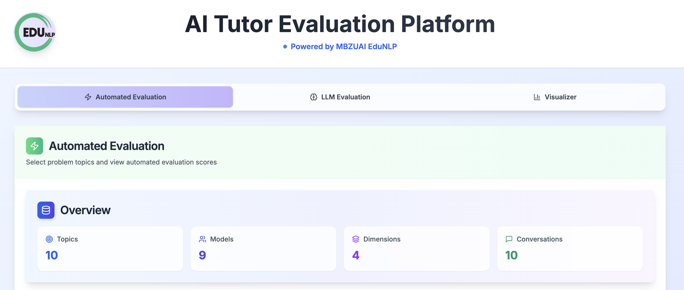

# Frontend Module: Demo App



This document provides details and usage instructions for the frontend module of the toolkit. It covers: (1) installation of dependencies, and (2) steps to launch the demo app locally.

The module requires an evaluated/annotated JSON file generated by the backend module, which is then displayed through a user-friendly interface. Educational stakeholders can interact with the app to understand the current pedagogical capabilities of AI tutors as assessed by both the automated model and the LLM-as-a-judge model.

The module consists of three components:

* **Automated Evaluation**: Provides automated evaluation results using an in-house fine-tuned model across four evaluation dimensions. This is built on top of [`src/autoeval`](src/autoeval).
* **LLM Evaluation**: Uses multiple LLM-as-a-Judge and built on top of [`src/llmeval`](src/llmeval).
* **Visualizer**: Enables rich visual analytics for interpreting evaluation scores across four pedagogical dimensions using evaluations from both [`src/autoeval`](src/autoeval) and [`src/llmeval`](src/llmeval).

## Features

* **Comparison Mode**: Compare two tutor responses side-by-side.
* **Multiple LLM-as-a-Judge Options**: Evaluate using multiple LLMs-as-a-judges.
* **Feedback System**: Rate and save your own preferences regarding tutor responses.
* **Custom Data Support**: Load and use your own dataset locally.

## Quick Start

### For Users (View Deployed App)

Visit the deployed application to explore the evaluation tool with the default dataset:
```
https://demo-ai-tutor.vercel.app/
```

## For Developers (Run Locally with a Custom Dataset)


### Ensure the Directory Structure

```
AITutor-EvalKit/
      ├── app/
      │   ├── api/
      │   │   ├── autoeval-data/      # Dataset metadata API
      │   │   ├── autoeval-context/   # Conversation context API
      │   │   ├── autoeval-results/   # Results API
      │   │   └── save-feedback/      # Feedback storage API
      │   ├── page.tsx                # Main page
      │   └── layout.tsx              # Root layout
      ├── components/
      │   ├── auto-eval-dataset.tsx   # Main evaluation component
      │   ├── charts/                 # Chart components
      │   └── ui/                     # UI components
      ├── lib/
      │   ├── dataset-config.ts       # Dataset configuration module
      │   ├── redis.ts                # Redis client
      │   └── utils.ts                # Utility functions
      ├── scripts/
      │   ├── dev-with-dataset.js     # Custom dataset dev script
      │   └── set-dataset-path.js     # Dataset path setter
      ├── data/
      │   └── default-dataset.jsonl   # Default dataset
      ├── DATASET_SETUP.md            # Dataset setup guide
      └── README.md                   # This file
```


### Install Dependencies

```bash
npm install
```

### Run with the Default Dataset

```bash
npm run dev
```

### Run with Your Own Dataset

The platform supports custom datasets in JSON format.

```bash
npm run dev:custom /path/to/your/dataset.json
```

Example:

```bash
npm run dev:custom assets/outputs/gpt5_model_predictions.json
```