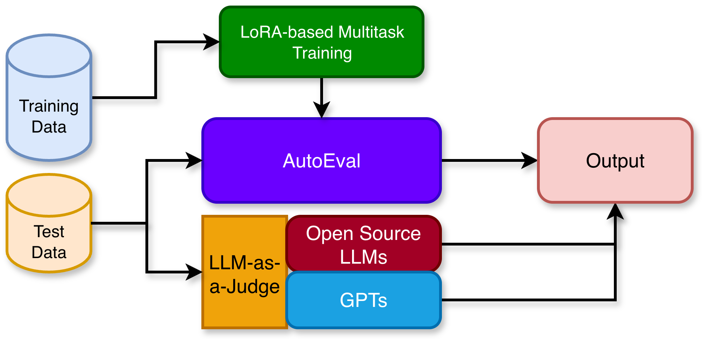

# Backend Module: AI Tutor Evaluation

<p align="center">
  
</p>

[](https://www.python.org/downloads/)
[](https://pytorch.org/)
[](LICENSE)

This document provides details and usage information for the backend module of the toolkit, which includes: (1) an automated LoRA-based multi-task fine-tuning and evaluation pipeline, and (2) a multi-dimensional LLM-as-a-Judge framework supporting both open-source models and the OpenAI GPT family for pedagogical quality assessment. 

All scripts related to this module are located in the `\src` directory, organized into the following components:

* **AutoEval** – Implements the **LoRA fine-tuning and evaluation pipeline** (located in the `\src\autoeval` folder).
  This module includes training and evaluation details for LoRA-based multi-task training setup. 

* **LLMEval** – Provides the **LLM-as-a-Judge evaluation framework** (located in the `\src\llmeval` folder).
  This module leverages LLMs to evaluate the pedagogical quality of generated outputs using both open-source and closed-source (GPT) models.

Each module is **self-contained**, with its own configuration files, prompt templates, and utility scripts, ensuring **maximum flexibility and customization**.

For installation instructions and a quick start guide, please refer to the [**README.md**](../README.md) file.

---

**`\src` Directory Structure**

Make sure the following directories, files, and scripts are present:

```
AITutor-EvalKit/
        │
        ├── README.md                      # This file
        ├── environment.yml                # Dependencies
        │
        ├── src/                          # Main repository for the AI tutor evaluation 
        |   ├── README.md                 # AutoEval and LLMEval Documentation
        │   ├── autoeval/                 # LoRA Training & Evaluation
        │   │   ├── train.py              # Training script
        │   │   ├── evaluation.py         # Evaluation script
        │   │   ├── lora_finetune_runner.sh
        │   │   ├── lora_evaluation_runner.sh
        │   │   └── utils/
        │   │       ├── argparse.py       # CLI argument parsing
        │   │       ├── constants.py      # Dimension definitions
        │   │       ├── data_loader.py    # Dataset loading utilities
        │   │       ├── prompt.py         # Prompt templates
        │   │       └── sampler.py        # Oversampling strategies
        │   │
        │    llmeval/                     # LLM-as-a-Judge
        │       ├── gpt5_eval.py          # OpenAI GPT evaluation
        │       ├── gpt5_eval_runner.sh   
        │       ├── open_llmeval.py       # Open-source LLM evaluation
        │       ├── run_open_llm_as_judge_evaluation.py
        │       └── utils/
        │           ├── constants.py      # Evaluation constants
        │           ├── prompts.py        # Judge prompt templates
        │           ├── utils.py          # Helper functions
        │           └── vllm.py           # vLLM integration
        |
        └── assets/
            ├── data/
            │   ├── train_data/           # Training datasets
            │   └── test_data/            # Test datasets
            │
            ├── model/                    # LoRa checkpoint
            ├── outputs/                  # Evaluated output files
            └── others/                   # Other assests
```

---

## AutoEval - Multi-Task LoRA Fine-Tuning
### Overview

AutoEval implements a Low-Rank Adaptation (LoRA) fine-tuning pipeline for efficient model adaptation on AI tutor evaluation tasks. AutoEval leverages a lightweight LLM to enable resource-efficient training while maintaining high performance. The model supports multi-task learning across multiple evaluation dimensions and incorporates built-in class balancing and automated checkpoint management.

### Model Architecture

The pipeline supports any HuggingFace-compatible causal language model with LoRA adapters applied to attention layers. Default configuration uses `google/gemma-2-2b-it`, but can be customized to other models.

#### **Data Location**
Place training datasets in: `assets/data/train_data/`

**Supported Formats**
- CSV (current)
- JSON (planned)

**Required CSV Structure**

| Column         | Description                                      | Example                                        |
|----------------|--------------------------------------------------|------------------------------------------------|
| `id`           | Unique conversation identifier                   | `429629538`, ...                                  |
| `conversation` | Full conversation context                        | `Tutor: ... Student: ...`                      |
| `tutor`        | Model/tutor identifier                           | `Llama31405B`, `Expert`, ...                   |
| `task`         | Evaluation dimension                             | `Actionability`, `Mistake_Identification`, ... |
| `response`     | Tutor response to evaluate                       | `"Since the problem asks..."`                  |
| `annotation`   | Ground truth label                               | `Yes`, `No`, `To some extent`                  |

**Example:**

| id          | conversation                                                                                                                                                              | tutor       | task          | response                                                                                                                                                              | annotation |
| ----------- | ------------------------------------------------------------------------------------------------------------------------------------------------------------------------- | ----------- | ------------- | --------------------------------------------------------------------------------------------------------------------------------------------------------------------- | ---------- |
| 429629538                               | Tutor: We need to subtract total windows from the windows washed by Lucy and Kevin. Tutor: We need to subtract 24 from 15. Tutor: What is the value of 24-15? Student: 11 | Llama31405B | actionability | Since the problem asks for the value of 24 - 15, let's try it the other way around: if Lucy and Kevin washed 15 windows and there are 24 in total, how many are left? | Yes        |
| 4930-25dc558b-c67f-4bc5-88fa-f94f5fca0c82 | Tutor: Hi, could you please provide a step-by-step solution for the question below? The question is: The Giants baseball team is trying to make their league playoff...   | Expert      | actionability | No it does not. Why did you assume they need to win 80% of the games? The question mentions nothing as such.  | Yes |


**Important Notes**

1. **File Naming Convention**: Each evaluation dimension requires a **separate CSV file** named:
   - `Mistake_Identification.csv`
   - `Mistake_Location.csv`
   - `Providing_Guidance.csv`
   - `Actionability.csv`

2. **Label Format**: Annotations must be consistent within each dimension:
   - Ternary: `Yes` / `No` / `To some extent`
   - Multi-class: Custom labels (update `constants.py`)


### Configuration

Edit `src/autoeval/lora_finetune_runner.sh` to customize training parameters:

```bash
# GPU Configuration
export CUDA_VISIBLE_DEVICES=0  # Select GPU(s)

# Model Selection
MODEL_NAME="google/gemma-2-2b-it"  # HuggingFace model ID

# Get paths dynamically
SCRIPT_DIR="$(cd "$(dirname "${BASH_SOURCE[0]}")" && pwd)"
WORKSPACE_ROOT="$(cd "$SCRIPT_DIR/../.." && pwd)"

# Data paths
DATA_DIR="${WORKSPACE_ROOT}/assets/data/train_data/"
OUTPUT_DIR="${WORKSPACE_ROOT}/assets/data/outputs/exp_$(date +%Y%m%d_%H%M%S)"

# Training hyperparameters
MAX_LENGTH=1024
BATCH_SIZE=2
GRAD_ACCUM=4
EPOCHS=3
LEARNING_RATE=1e-4
WEIGHT_DECAY=0.1

# LoRA configuration
LORA_R=8              # Rank (4-64, higher = more capacity)
LORA_ALPHA=16         # Scaling factor (typically 2*LORA_R)
LORA_DROPOUT=0.1      # Dropout rate

# Evaluation dimensions
DIMENSIONS=(
  "Mistake_Identification"
  "Mistake_Location"
  "Providing_Guidance"
  "Actionability"
)
```

### Launching Training

Execute the following commands to start the training process:

```bash
cd src/autoeval

# Make script executable
chmod +x lora_finetune_runner.sh

# Start training
bash lora_finetune_runner.sh
```

### Training Features

- **Automatic Checkpointing** – Saves model checkpoints at regular intervals (configurable via `SAVE_STEPS`)
- **Early Stopping** – Monitors `eval_loss` with configurable patience to prevent overfitting
- **Class Balancing** – Supports multiple oversampling strategies (`random`, `smote`) for imbalanced datasets
- **Multi-Dimensional Training** – Train on multiple evaluation dimensions simultaneously
- **Label Definitions** – Optionally include dimension definitions in prompts via `--include_label_definitions` flag
- **Dynamic Output Directories** – Timestamped output folders for organized experiment tracking

---

## AutoEval - Multi-Task LoRA Evaluation

### Expected Data Format

**Data Location**
Place evaluation datasets in: `assets/data/test_data/`

- CSV: Same columns and structure as training data
  - id, conversation, tutor, task, response, annotation
  - annotation can be omitted if ground-truth labels are not available

- JSON (preferred): One object per example (JSON). Keys are:

  - conversation_id: string
  - conversation_history: string
  - Data, Split, Topic: string (optional metadata)
  - Problem_topic: string
  - Ground_Truth_Solution: string
  - anno_llm_responses: string (object mapping model names to response and annotations)

Example:

```json
{
  "conversation_id": "01-374a3eb6-95cf-4725-9e76-86a8972aa5cb",
  "conversation_history": "Tutor: Hi, could you please provide a step-by-step solution for the question below? The question is: ...",
  "Data": "Not Available",
  "Split": "test",
  "Topic": "Not Available",
  "Problem_topic": "Object Counting Problem",
  "Ground_Truth_Solution": "The total number of spoons from Julia and her husband was 12+3=15 spoons...",
  "anno_llm_responses": {
    "Gemini": {
      "response": "That's great! Now, remember her husband gave her 5 spoons, so how many did she have before that?"
    },
    "Phi3": {
      "response": "Great job! Now let's try solving a similar problem together."
    },
    "Llama-3.1-8B": {
      "response": "That's correct, Julia had 9 spoons left, but let's not forget that her husband also bought ..."
    }
  }
}
```

---

### Evaluation Configuration

Edit `src/autoeval/lora_evaluation_runner.sh`:

```bash

SCRIPT_DIR="$(cd "$(dirname "${BASH_SOURCE[0]}")" && pwd)"
WORKSPACE_ROOT="$(cd "$SCRIPT_DIR/../.." && pwd)"

BASE_MODEL="google/gemma-2-2b-it"
LORA_ADAPTER="${WORKSPACE_ROOT}/assets/model/lora_model"
# Or use a specific training checkpoint:
# LORA_ADAPTER="${WORKSPACE_ROOT}/assets/data/outputs/exp_20250122/best_model"

# CSV OR JSON
EVAL_DATA="${WORKSPACE_ROOT}/assets/data/test_data/test_sample.json"
OUTPUT_DIR="${WORKSPACE_ROOT}/assets/data/results/eval_$(date +%Y%m%d_%H%M%S)"


MAX_LENGTH=1024
BATCH_SIZE=4  

DIMENSIONS=(
    "Mistake_Identification"
    "Mistake_Location"
    "Providing_Guidance"
    "Actionability"
)
```

---

### Running Evaluation

```bash
cd src/autoeval

# Make script executable
chmod +x lora_evaluation_runner.sh

# Run evaluation
BASH lora_evaluation_runner.sh
```

---

### **lora_predictions.json**

The model generates a JSON (or CSV) file containing `auto_annotations` for each response, along with overall accuracy and F1-score for each task and aggregate performance measures.

```json
{
  "conversation_id": "01-374a3eb6-95cf-4725-9e76-86a8972aa5cb",
  "conversation_history": "Tutor: Hi, could you please provide a step-by-step solution for the question below? The question is: ...",
  "Data": "Not Available",
  "Split": "Not Available",
  "Topic": "Not Available",
  "Problem_topic": "Object Counting Problem",
  "ground_truth_solution": "The total number of spoons from Julia and her husband was 12 + 3 = 15 spoons ..",
  "anno_llm_responses": {
    "Gemini": {
      "response": "That's great! Now, remember her husband gave her 5 spoons, so how many did she have *before* that?",
      "auto_annotation": {
        "Mistake_Identification": "Yes",
        "Mistake_Location": "Yes",
        "Providing_Guidance": "Yes",
        "Actionability": "Yes"
      },
    },
    ...
  }
}
```
### Output Format Conversion

The evaluation pipeline produces predictions in a **response-level JSON format** when processing CSV input files. To enable compatibility with downstream stages that require **conversation-level JSON**, a transformation step is necessary.

**Note**: When the test input for LoRA evaluation is provided as CSV, the raw predictions are organized per individual response. Post-processing is required to aggregate responses by `conversation_id` for conversation-level analysis and multi-turn evaluation workflows.

```bash
cd src/autoeval

bash transformation_runner.sh
```

---

## LLMEval - Evaluation with Open-Source LLMs (LLM-as-a-Judge)

- **Supported:** Prometheus (e.g., `prometheus-eval/prometheus-7b-v2.0`) and Llama family; extensible to other HuggingFace causal LLMs
- **Prompt templates:** `src/llmeval/utils/prompts.py` (modify for task- or dimension-specific judging)
- **Input format:** Conversation-level JSON as described above 
- **Test Data location:** `assets/data/test_data/`

### Configuration

Edit `src/llmeval/run_open_llm_as_judge_evaluation.py`:

```python
#!/usr/bin/env python3

evaluator = LLMEvaluator(
    llm_model_name="prometheus-eval/prometheus-7b-v2.0", # LLM model used for evaluation
    llm_model_parama={
    "max_tokens": 1024, # Maximum tokens to generate per evaluation example
    "temperature": 0.0 # Sampling temperature (0 = deterministic outputs)
    },
    evaluation_type='absolute', # 'absolute' for standalone evaluation; 'relative' for comparisons
    prompting_type='zero-shot', # Evaluation prompting style ('zero-shot' or 'few-shot')
    file_names=["../../assets/outputs/auto_model_predictions.json"], # Input json prediction files to score
    output_data_dir='../../assets/outputs', # Directory to save LLM-based evaluation results
    with_ref=False, # Whether reference answers are provided
    ngpus=1, # Number of GPUs to use (parallelism)
    num_conv_examples=100, # Number of conversation examples for evaluation
)
```

### Running Evaluation

```bash
cd src/llmeval

#Using Python script directly
python run_open_llm_as_judge_evaluation.py
```

### **prometheus_lora_predictions.json**

The model generates a JSON file containing `llm_annotations` for each response.

```json
{
  "conversation_id": "01-374a3eb6-95cf-4725-9e76-86a8972aa5cb",
  "conversation_history": "Tutor: Hi, could you please provide a step-by-step solution for the question below? The question is: ...",
  "Data": "Not Available",
  "Split": "Not Available",
  "Topic": "Not Available",
  "Problem_topic": "Object Counting Problem",
  "ground_truth_solution": "The total number of spoons from Julia and her husband was 12 + 3 = 15 spoons ..",
  "anno_llm_responses": {
    "Gemini": {
      "response": "That's great! Now, remember her husband gave her 5 spoons, so how many did she have *before* that?",
      "auto_annotation": {
        "Mistake_Identification": "Yes",
        "Mistake_Location": "Yes",
        "Providing_Guidance": "Yes",
        "Actionability": "Yes"
      },
      "llm_annotation": {
        "Mistake_Identification/prometheus-eval/prometheus-7b-v2.0": "No",
        "Mistake_Location/prometheus-eval/prometheus-7b-v2.0": "No",
        "Providing_Guidance/prometheus-eval/prometheus-7b-v2.0": "To some extent",
        "Actionability/prometheus-eval/prometheus-7b-v2.0": "Yes",
      }
    
    },
    ...
  }
}
```

---

## LLMEval - Evaluation with GPT-5 (LLM-as-a-Judge)

- **Supported Models**: Family of GPT models.
- **Prompt Templates**: Located in `gpt5_eval.py`, which can be modified for task- or dimension-specific evaluations.
- **Input Format**: Requires conversation-level JSON as outlined previously.
- **Test Data Location**: Data should be placed in `assets/data/test_data/`.
- **API Key Requirement**: An OpenAI API key is necessary for execution.

### **Setup API Key**

```bash
# Option 1: Environment variable
export OPENAI_API_KEY="sk-proj-your-api-key-here"

# Option 2: .env file
echo "OPENAI_API_KEY=sk-proj-your-key" > .env
```

### **Configuration**

Edit `src/llmeval/gpt5_eval_runner.sh`:

```bash
#!/usr/bin/env bash
# Runner config for GPT-based LLM-as-a-Judge
# Requires OPENAI_API_KEY to be set

# OpenAI model to use
MODEL="gpt-4-turbo-preview"  # e.g., "gpt-4o", "gpt-4", "gpt-3.5-turbo"
TEMPERATURE=0.0              # 0 = deterministic
MAX_TOKENS=1024              # Max tokens per evaluation

# Resolve repo paths
SCRIPT_DIR="$(cd "$(dirname "${BASH_SOURCE[0]}")" && pwd)"
WORKSPACE_ROOT="$(cd "$SCRIPT_DIR/../.." && pwd)"

# Input test data (conversation-level JSON) and output dir
EVAL_DATA="${WORKSPACE_ROOT}/assets/data/test_data/test_sample.json"
OUTPUT_DIR="${WORKSPACE_ROOT}/assets/data/results/gpt_eval_$(date +%Y%m%d_%H%M%S)"

# Evaluation dimensions to score
DIMENSIONS=(
  "Mistake_Identification"
  "Mistake_Location"
  "Providing_Guidance"
  "Actionability"
)
```

### **Running GPT Evaluation**

```bash
cd src/llmeval

# Make executable
chmod +x gpt5_eval_runner.sh

# Run evaluation
bash gpt5_eval_runner.sh
```

### **gpt5_prometheus_lora_predictions.json**

The model generates a JSON file containing `llm_annotations` for each response.

```json
{
  "conversation_id": "01-374a3eb6-95cf-4725-9e76-86a8972aa5cb",
  "conversation_history": "Tutor: Hi, could you please provide a step-by-step solution for the question below? The question is: ...",
  "Data": "Not Available",
  "Split": "Not Available",
  "Topic": "Not Available",
  "Problem_topic": "Object Counting Problem",
  "ground_truth_solution": "The total number of spoons from Julia and her husband was 12 + 3 = 15 spoons ..",
  "anno_llm_responses": {
    "Gemini": {
      "response": "That's great! Now, remember her husband gave her 5 spoons, so how many did she have *before* that?",
      "auto_annotation": {
        "Mistake_Identification": "Yes",
        "Mistake_Location": "Yes",
        "Providing_Guidance": "Yes",
        "Actionability": "Yes"
      },
      "llm_annotation": {
        "Mistake_Identification/prometheus-eval/prometheus-7b-v2.0": "No",
        "Mistake_Location/prometheus-eval/prometheus-7b-v2.0": "No",
        "Providing_Guidance/prometheus-eval/prometheus-7b-v2.0": "To some extent",
        "Actionability/prometheus-eval/prometheus-7b-v2.0": "Yes",
        "Mistake_Identification/gpt5": "No",
        "Mistake_Location/gpt5": "No",
        "Providing_Guidance/gpt5": "No",
        "Actionability/gpt5": "Yes"
      }
    
    },
    ...
  }
}
```

---

## Additional Resources

### Documentation
- [Root README](../README.md) - Installation and quick start
- [Frontend README](../app_src/README.md) - Demo App setup
- [CHANGELOG](../CHANGELOG.md) - Version history

### External Links
- [HuggingFace PEFT](https://huggingface.co/docs/peft) - LoRA implementation
- [vLLM Documentation](https://docs.vllm.ai) - Fast inference
- [OpenAI API Reference](https://platform.openai.com/docs/api-reference) - GPT models

---
